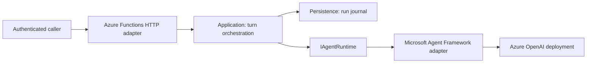

# NOERITH Agent Framework Reference architecture

## Context

Reference architecture for evidence-first AI agents built with Microsoft Agent Framework.

The project addresses: Provide a secure, testable starting point for integrating Microsoft Agent Framework without coupling to SkyAI internals.

## Scope and system context

The first milestone is a bounded, evidence-aware agent-turn API for engineering teams. It is not a
production chatbot, a SkyAI fork, or a Foundry deployment. A caller submits one turn, the application
coordinates a provider-neutral runtime, and the result is returned with a correlation-friendly run ID.

The Azure OpenAI deployment and any future Foundry project are outside this repository's trust boundary.
Their endpoints and identities are supplied at runtime through local environment configuration or a
deployment-time secret/configuration service.

## Code structure

| Area | Responsibility | May reference Microsoft Agent Framework? |
| --- | --- | --- |
| `Api` | Azure Functions host, HTTP mapping, provider adapter, DI | Yes |
| `Application` | agent-turn contracts, orchestration, ports, failure semantics | No |
| `Persistence` | run-journal implementation; in-memory for the reference baseline | No |
| `Tests` | deterministic contract tests using fake runtime/journal implementations | No live provider |

Dependencies flow from the edge inward: `Api -> Application <- Persistence`. The application layer owns
the provider-neutral contracts; the provider adapter implements them at the edge.

## Data and AI considerations

- The baseline accepts user prompts but does not persist prompt or response content in its run journal.
- The journal records lifecycle metadata only: run ID, session ID, correlation ID, provider identity,
  timestamps, and outcome. This keeps observability useful without silently creating a content-retention
  system.
- The provider response contract supports evidence items, but the initial Azure OpenAI adapter emits none.
  Retrieval, citations, source ownership, and evaluation must be designed before adding RAG or tools.
- Human review is required before an agent can trigger business actions, access sensitive data, or use
  non-Azure third-party services.

## Security and operations

- Never commit endpoint credentials, API keys, user data, or production configuration.
- Local development uses `DefaultAzureCredential`; a production deployment should set
  `NOERITH_AGENT_CREDENTIAL=managed-identity` and use least-privilege managed identity access.
- The Function-level key is not user authorization. Add an application identity and permission policy
  before a public or multi-user deployment.
- CI restores, formats, builds, tests, and scans C# with CodeQL. CI has read-only contents permission;
  only CodeQL receives `security-events: write`.
- No Azure resource, Foundry project, model deployment, or production telemetry is provisioned by this
  repository.

## Decisions

Use `docs/decisions/` for decisions that affect architecture, risk, data handling, or long-term maintenance.
